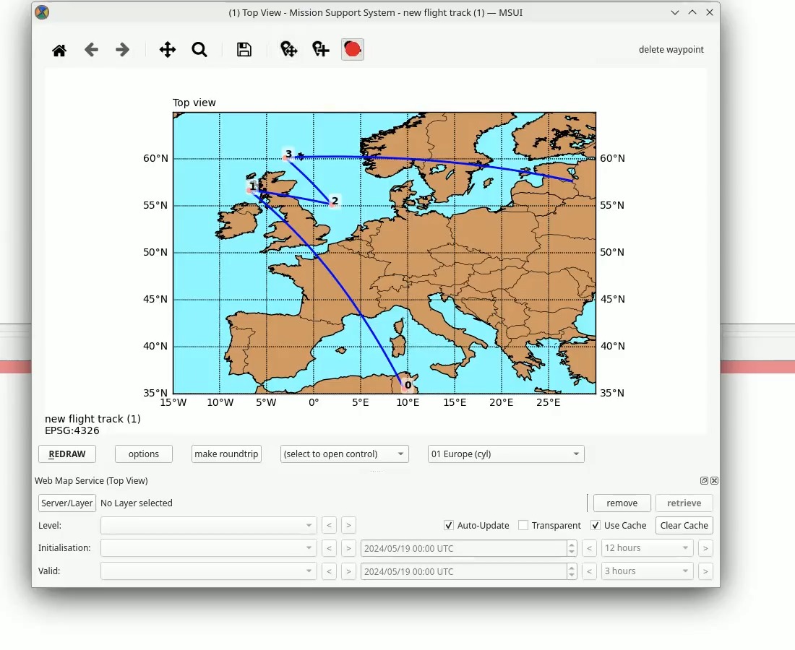

The Mission Support System (MSS) is a software that is written by
scientists in the field of atmospheric science. The purpose is to have a
tool that simplifies the process for planning a scientific flight.
A detailed description is on [Mission Support System Documentation](https://mss.readthedocs.io/en/stable/).

Some videos about the Mission Support System Collaboration Platform

## Tutorials
During GSOC 2021 the base for the MSS tutorials got created by [Hrithik Kumar Verma](https://github.com/Open-MSS/MSS/wiki/Generating-a-tool-chain-tutorial-for-the-MSUI-user-interface-by-automation-operations-:-GSoC---2021).

For further tutorialss:
https://mss.readthedocs.io/en/stable/tutorial.html

## Contact US

IRC: <https://web.libera.chat/?nick=Guest&#mss-gsoc> (This channel is synced to our gsoc slack channel)  
IRC: <https://web.libera.chat/?nick=Guest&#mss-general> (This channel is synced to our general slack channel)

Slack: [https://mss-devel.slack.com](https://mss-devel.slack.com) (invitation on request by email)

Email: <mss-info@fz-juelich.de>

Please subscribe to <https://lists.fz-juelich.de/mailman/listinfo/mss-info>
